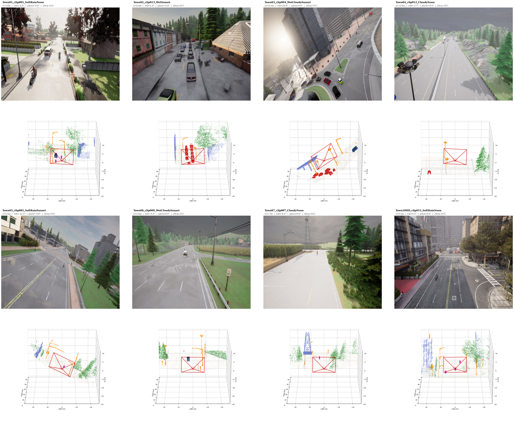
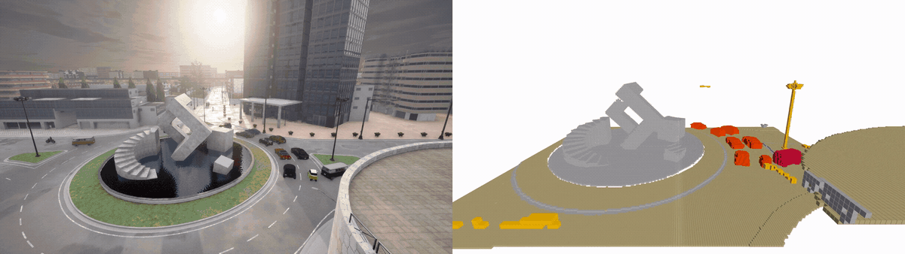

# SkyShield: Occupancy as a Safety Interface for Low-Altitude UAV Autonomy

<p align="center">
  <b>Front-view Monocular Semantic Occupancy Benchmark for Low-Altitude UAV Autonomy</b>
</p>

<p align="center">
  <a href="https://arxiv.org/abs/2606.00747"></a>
  <a href="#"></a>
  <a href="#"></a>
</p>

<div align="center">

  

  <br><br>

  <a href="assets/SkyShield.mp4">
    
  </a>

  <br>

  <sub>SkyShield studies front-frustum semantic occupancy prediction for safety-critical low-altitude UAV autonomy. Click the animation to open the MP4 demo.</sub>

</div>

---

## Introduction

**SkyShield** is a front-view monocular semantic occupancy benchmark for urban low-altitude UAV autonomy. It targets UAV flight below 20 meters, where safe navigation requires not only recognizing visible objects, but also understanding the occupied and free 3D space that the aerial agent is about to enter.

Existing UAV perception datasets mainly focus on 2D detection, tracking, segmentation, or 3D bounding boxes. In contrast, SkyShield formulates low-altitude UAV perception as **front-frustum semantic occupancy prediction**. Given a single front-view RGB image, the task is to infer semantic occupied voxels and observed free-space voxels in the current camera frustum.

This setting is motivated by the safety-critical nature of low-altitude flight. In human-scale urban airspace, thin geometry, vegetation, occlusion, cluttered corridors, dynamic actors, and frame-wise changing UAV attitude can directly determine whether the forward space is traversable. SkyShield therefore studies occupancy not merely as a perception target, but as a safety interface between high-level UAV autonomy and physical flight.

The repository will provide the SkyShield benchmark, the KAR-mIoU safety-aware evaluation metric, and the SkyOcc reference baseline. Code and dataset will be released publicly.

---


## Task Definition

SkyShield studies **front-view monocular semantic occupancy prediction** for low-altitude UAV flight. Given a single front-view RGB image, the model predicts the semantic occupancy of the current camera frustum, including occupied voxels with semantic labels and observed free-space voxels.

The task is UAV-centered and safety-oriented. Unlike ground-vehicle occupancy, low-altitude UAV perception must handle frame-wise changes in pose, altitude, roll, pitch, and yaw, while reasoning about the forward 3D space the UAV may soon enter. Unknown regions are excluded from calibrated supervision.

In essence, SkyShield asks whether a UAV can infer the occupied and free space ahead from monocular vision under dynamic aerial motion.


---

## Dataset: SkyShield

### Overview

SkyShield is generated in CARLA and focuses on urban low-altitude UAV flight below 20 meters. The benchmark contains **36K front-view UAV samples** collected across diverse urban scenes, weather conditions, trajectories, and camera attitudes.

<div align="center">

<table>
  <thead>
    <tr>
      <th align="left">Item</th>
      <th align="left">Value</th>
    </tr>
  </thead>
  <tbody>
    <tr>
      <td>Simulator</td>
      <td>CARLA</td>
    </tr>
    <tr>
      <td>Total samples</td>
      <td>36K</td>
    </tr>
    <tr>
      <td>Scenes</td>
      <td>8 urban scenes</td>
    </tr>
    <tr>
      <td>Weather conditions</td>
      <td>10</td>
    </tr>
    <tr>
      <td>Clips per scene</td>
      <td>15</td>
    </tr>
    <tr>
      <td>Clip duration</td>
      <td>12 s</td>
    </tr>
    <tr>
      <td>Capture frequency</td>
      <td>25 Hz</td>
    </tr>
    <tr>
      <td>Train / Val / Test</td>
      <td>29K / 3.2K / 3.8K</td>
    </tr>
    <tr>
      <td>Altitude range</td>
      <td>&lt; 20 m</td>
    </tr>
    <tr>
      <td>Learning input</td>
      <td>Monocular front-view RGB</td>
    </tr>
    <tr>
      <td>Annotation signals</td>
      <td>Dual LiDAR + simulator semantics</td>
    </tr>
  </tbody>
</table>

</div>

Each sample provides a monocular front-view RGB image, frame-wise 6-DoF UAV body pose, fixed front-camera calibration, derived dynamic camera geometry, UAV motion states, and front-frustum semantic occupancy labels.

---

## Evaluation Metrics

SkyShield reports both **mIoU** and **Kinematics-Aware Risk mIoU (KAR-mIoU)**.

mIoU measures standard class-wise semantic occupancy accuracy by treating all valid voxels equally. While useful for evaluating global reconstruction quality, it does not distinguish between harmless distant errors and safety-critical near-field failures.

KAR-mIoU addresses this limitation by weighting false positives and false negatives according to UAV motion and time-to-collision. Errors in short-TTC regions receive larger penalties, while correct predictions are not artificially rewarded by proximity.

Thus, mIoU measures overall occupancy quality, whereas KAR-mIoU measures whether prediction failures occur in the regions most critical to flight safety. For the detailed definition and evaluation protocol of KAR-mIoU, please refer to the paper.

---

## Baseline: SkyOcc

**SkyOcc** is the reference monocular UAV occupancy baseline for SkyShield. It is designed as a geometry-first and safety-prior model for front-view semantic occupancy prediction under dynamic low-altitude UAV motion.

SkyOcc consists of three main ideas.

First, it uses **attitude-aware spatial projection**. The frame-wise UAV pose and fixed camera calibration define a consistent projection from UAV-centered 3D reference points to the front-view image. This explicitly accounts for roll, pitch, yaw, altitude, and viewpoint changes without introducing an additional post-hoc pose correction.

Second, it uses a **spatiotemporal pillar encoder**. Historical pillar features are aligned to the current UAV-centered coordinate system through ego-motion and then fused with current-frame image evidence. This enables temporal consistency while preserving the observer-centered nature of the task.

Third, it applies **safety-prior voxel optimization**. Sparse collision-critical categories, such as thin structures, vehicles, and vulnerable road users, occupy very few voxels but are essential for safe low-altitude flight. SkyOcc therefore increases learning pressure on these long-tail safety classes and combines class-balanced supervision with an IoU-oriented objective.

SkyOcc is intended as a transparent and reproducible baseline rather than a final solution. The code will be released publicly soon.

---

## Citation

If you find SkyShield, KAR-mIoU, or SkyOcc useful in your research, please cite:

```bibtex
@article{gao2026skyshield,
  title   = {SkyShield: Occupancy as a Safety Interface for Low-Altitude UAV Autonomy},
  author  = {Gao, Jie and Ma, Jie and Lin, Kaihui and Ye, Kai and Zhang, Miaohui and Dai, Pingyang and Cao, Liujuan},
  journal = {arXiv preprint arXiv:2606.00747},
  year    = {2026}
}
```

---

## Acknowledgements

SkyShield is built upon CARLA and is inspired by recent progress in semantic occupancy prediction, monocular 3D perception, and UAV autonomy. We thank the open-source community for providing tools and benchmarks that support reproducible research.

---

## Contact

For questions about the dataset, benchmark, or code release, please contact:

```text
jiegao@stu.xmu.edu.cn
```
